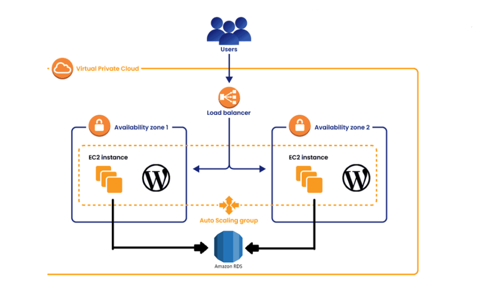
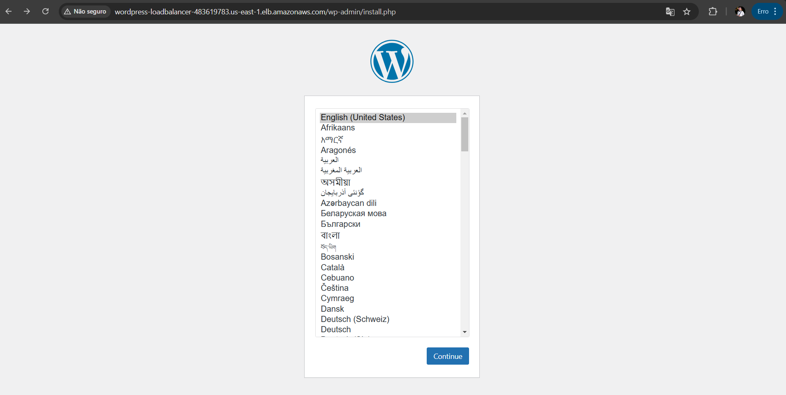

# Ambiente WordPress Docker-AWS


## **Sobre o projeto**

Este projeto se consistiu na implementação de um ambiente WordPress utilizando Docker na AWS, aplicando boas práticas de infraestrutura e automação para garantir desempenho, segurança e alta disponibilidade.

A solução foi estruturada com contêineres Docker em uma instância EC2, integrada a um banco de dados RDS MySQL para gerenciamento eficiente de dados. O armazenamento de arquivos estáticos foi feito com AWS EFS, permitindo compartilhamento entre múltiplas instâncias, enquanto um Load Balancer foi configurado para otimizar a distribuição de tráfego.


## 🛠 Tecnologias Utilizadas  
- **Docker** para containerização  
- **AWS EC2** para hospedagem  
- **AWS RDS (MySQL)** para banco de dados gerenciado  
- **AWS EFS** para armazenamento de arquivos   
- **Load Balancer** para distribuir o tráfego
- **AWS Auto Scaling** para ajuste automático da capacidade computacional  

## **Arquitetura**



## **Objetivos**

O projeto teve como principal objetivo a implantação de um ambiente WordPress na AWS utilizando Docker, com boas práticas de infraestrutura em nuvem para garantir escalabilidade, segurança e disponibilidade. Para isso, foram definidos os seguintes objetivos específicos:

* Criar e configurar uma infraestrutura escalável e segura na AWS para hospedar o WordPress, evitando exposição direta ao público e garantindo alta disponibilidade.

* Implementar a aplicação em contêineres, utilizando Docker.

* Configurar um banco de dados gerenciado no RDS MySQL para armazenar os dados da aplicação de forma segura e eficiente.

* Utilizar o AWS EFS para armazenamento de arquivos estáticos.

* Implementar um Load Balancer para gerenciar o tráfego da aplicação.

* Automatizar a infraestrutura com script *user_data*.
  

## **1. Configuração da Virtual Private Cloud (VPC)**

Primeiramente, foi necessário a criação de uma VPC exclusivamente para esse projeto. Acessando o serviço **VPC** na console **AWS** realizei as configurações abaixo:

   * **Criar VPC:**

     * **Consiguração VPC:** VPC e mais 

     * **Nome:** wordpress

     * **IPv4:** 10.0.0.0/16 

     * **IPv6:** Nenhum
   
     * **Arrendamento**: Padrão
  
     * **Número de zonas (AZs):** 2
   
     * **Número de subnets:** 2 públicas e 2 privadas

     * **NAT gateways:** 1 por AZ.
  
     * **VPC endpoints:** Nenhum.
#

* Em **Customizar subnets** alterei todas as subnets para **/24**.
    
    * Essa escolha irá nos gerar 256 ips por subnet, mas apenas 251 ficarão disponíveis, pois, 5 ips são gerenciados pela AWS.


## **2. Criação dos Security Groups**

Os Security Groups são necessários para garantir o bom funcionamento do projeto, pois, são eles que definem as regras de entrada e saída dos recursos.

Ainda no serviço **VPC** realizei as configurações dos grupos de segurança:

* Sg-loadbalancer
   * **Regras de entrada e saída:**
     * HTTP e HTTPS -> Qualquer IPV4

* Sg-ec2
  * **Regras de entrada:**
    * HTTP e HTTPS -> Sg-loadbalancer
    * SSH -> Qualquer IPV4 (Somente para testes, o ideal seria o IP da máquina, para mais segurança)
  * **Regras de saída:**
    * (Padrão)

* Sg-rds
  * **Regras de entrada:**
    * MySQL -> Sg-ec2
  * **Regras de saída:**
    * Padrão   

* Sg-rds
  * **Regras de entrada:**
    * NFS -> Sg-ec2
  * **Regras de saída:**
    * Padrão   


## 3. Banco de dados no Relational Database Service (RDS)
O serviço web WordPress necessita de um banco de dados para armazenar suas informações, logs e se manter de forma estática. Desse modo, configurei um banco de dados free tier do RDS. Mas como iniciarei duas instâncias com subnet privada é preciso, dentro do serviço RDS, configurar um grupo de subnets contendo apenas as subnets privadas. 

### 3.1. Criação do Grupo de Sub-redes Privadas
  * Na aba lateral esquerda do serviço **RDS** acessei **Subnet groups** e cliquei em **Create DB subnet group**
  * Em seguida preenchi todos os campos:
    * **Nome:** private-subnet-group
    * **Descrição:** Grupo com sub-redes privadas da VPC 
    * **VPC**: wordpress-vpc
    * **Escolhi as duas Availability Zones que criei juntamente com a VPC**
    * **Escolhi as sub-redes privadas de cada zona**
    * **Criar** para finalizar a criação do grupo de sub-redes privadas.


### 3.2. Configuração do banco de dados RDS
  
   *  Escolhi o método de configuração padrão com o tipo de motor MySQL e modelo no Nível gratuito.
   * **Identificador de instância do BD:** wordpress-db
   * **Nome de usuário mestre:** admin
   * **Senha:** ************
   * **Instância:** db.t3.micro
   * **Dimensionamento automático de armazenamento:** Desmarcar

Conectividade

   * **Não se conecte a um recurso de computação EC2** (A conectividade ocorrerá através do endpoint do RDS no arquivo *.yml* para subir o site WordPress utilizando docker-compose)
   * **VPC:** wordpress-vpc
   * **Grupo de sub-rede do BD:** private-subnet-group (criado anteriormente)
   * **Acesso público:** Não
   * **Grupo de Segurança:** Sg-rds
  
Configurações Adicionais

   * **Nome inicial do banco de dados:** wordpress 
  (importante configurar essa parte para a imagem do wordpress subir sem problemas.)
  * **Desabilitar backups automatizados e criptografia**

As demais configurações podem permanecer padronizadas.

Agora com o RDS configurado, é possível pegar o endpoint do banco de dados e toda as outras informações necessárias para inserir no arquivo **user_data** na parte de **Criação do arquivo docker-compose.yml**. 

``` bash

    environment:
      WORDPRESS_DB_HOST: <Endpoint_RDS>:3306
      WORDPRESS_DB_USER: admin
      WORDPRESS_DB_PASSWORD: <Senha_do_banco_de_dados>
      WORDPRESS_DB_NAME: wordpress


```

## 4. Criação do Elastic File System (EFS)

Configurei o EFS para compartilhamento de arquivos entre duas instâncias. 

* No serviço EFS da console AWS acessei **Criar sistemas de arquivo** e escolhi a opção *Personalizar* e  efetuei as seguintes configurações:

   * **Nome:** wordpress-efs
   * **Tipo de sistema de arquivo:** Regional (Para armazenar dados em várias Zonas de Disponibilidade)
   * **Backups automáticos:** Desmarcar
   * **Criptografia de dados em repouso:** Desmarcar
  #
* Acesso à rede
   * **VPC:** wordpress-vpc
   * **Zona de disponibilidade:** sub-redes privadas
   * **Grupo de Segurança:** Sg-efs

Quando o sistema de arquivos carrega por completo fica disponível a ação de monta-lo aonde quisermos, nesse caso, nas instâncias, utilizando o arquivo .sh **user_data**. Clicando no sistema já criado e acessando *Anexar* é possível copiar o comando em **Usando o cliente do NFS** e alterar no arquivo:

```bash 

# Monta o sistema de arquivos da Amazon EFS
sudo mount -t efs -o tls <ID_EFS>:/ /mnt/efs

```

## 5. Criando instâncias privadas no Elastic Compute (EC2)

Precisei configurar duas Instâncias EC2 privadas, uma em cada zona de disponibilidade. As demais configurações foram iguais para ambas as máquinas.

* **Configurei as tags de acordo com a necessidade**
* **Imagem:** Ubuntu (Gratuito)
* **Tipo de Instância:** t2.micro
* **Par de chaves**: Do tipo *.pem*
  #
* **Configuração de Rede**
  * **VPC:** wordpress
  * **Subnet:** Subnet privada, 1 em cada zona
  * **IP Publico:** Habilitado
  * **Grupo de Segurança:** Sg-ec2
  #
* **Detalhes adicionais**
  * **Dados do Usuário:** Fazer upload do arquivo *user_data.sh*


## 8. Bastion Host
A utilização deste recurso foi necessária para, através dele, acessar as máquinas privadas. O bastion host também é uma máquina do serviço EC2 a única diferença é que ela será pública e não conterá o arquivo *user_data.sh*. Portanto, em sua criação descartei o arquivo citado anteriormente e escolhi uma das subnet públicas já criadas, nesse caso independe a zona escolhida. Tirando esses dois, o restante da configuração permanece igual a das máquinas privadas. 


## 7. Criação do Classic Load Balancer

Esse recurso é encontrado no serviço EC2 na aba lateral esquerda. O Classic Load Balancer distribui o tráfego de entrada de aplicações em vários destinos de instância do EC2 em várias zonas de disponibilidade. Isso aumenta a tolerância a falhas das aplicações. O Elastic Load Balancing detecta instâncias não íntegras e direciona o tráfego somente para instâncias íntegras. 

* **Configuração necessária**
  * **Nome:** wordpress-loadbalancer (Do modo que preferir)
  * **Voltado para a internet.**
  * **VPC:** wordpress
  * **Grupo de Segurança:** Sg-loadbalancer (Inicialmente criado)
  * **Caminho de ping:** /wp-admin/install.php
  * **Adicionar as Instâncias privadas e finalizar a criação.**

## 8. Configurando o Auto Scalling Groups

Grupos de Auto Scaling são coleções de instâncias do Amazon EC2 que permitem recursos de dimensionamento automático e gerenciamento de frota monitorando as instâncias e ajustando automaticamente a capacidade para manter um desempenho constante e previsível pelo menor custo possível. Esses recursos ajudarão a manter a integridade e a disponibilidade do site WordPress. 

Configurações realizadas:

* Criação de um Template
  * Ao tentar criar um grupo de escalabilidade será necessário criar um modelo de instância. Esse modelo conterá quase a mesma configuração das instâncias privadas, incluindo o upload do arquivo *user_data.sh*. A única diferença é que deve ser criado sem a escolha de uma subnet, pois, essa informação se dará nas próximas etapas de criação do auto scalling.
  #
* Opções de inicialização da instância
  * **VPC:** wordpress
  * **Zonas de disponibilidade e sub-redes:** zona e sub-redes privadas
  #
* Integrar com outros serviços 
  * Associar o Classic Load Balancer já existente
#
* Configurar tamanho e dimensionamento do grupo
  * **Capacidade desejada:** 2
  * **Capacidade mínima e máxima:** 2 

## 9. Acessando o site WordPress

Basta acessar o DNS do Load Balancer no navegador web



## Conclusão


O projeto de implantação do WordPress na AWS permitiu a criação de um ambiente altamente disponível, escalável e seguro para hospedagem da aplicação. A utilização de Docker para criação de contêiner, juntamente com serviços gerenciados como RDS MySQL e Amazon EFS, garantiu maior flexibilidade e eficiência na configuração da infraestrutura. Além disso, a implementação do Load Balancer aliado ao Auto Scalling Group proporcionou melhor distribuição do tráfego, otimizando o desempenho da aplicação e proporcionando uma maior escalabilidade dos recursos com tolerância a falhas e gestão de custos.

Iniciar este projeto foi um grande desafio. No começo, a principal dificuldade foi simplesmente dar o primeiro passo. Com tantas tecnologias envolvidas – Docker, AWS, RDS, Load Balancer e EFS – surgiu a dúvida: por onde começar? A falta de um caminho claro tornou a estruturação inicial um processo complexo, exigindo pesquisas, testes e muitas tentativas para encontrar a melhor abordagem.

Ao longo do desenvolvimento, um dos maiores obstáculos foi a configuração da infraestrutura. Muitas vezes, ao tentar avançar, as instâncias estavam fora de serviço, e identificar a causa nem sempre era simples. Problemas de rede, permissões e configurações incorretas exigiram paciência e análise detalhada para serem resolvidos. Houve, também, momentos de frustração ao ver a aplicação WordPress inacessível ou os contêineres falhando sem uma explicação imediata. Mas aos poucos, com persistência e ajustes contínuos, cada problema foi sendo compreendido e solucionado.